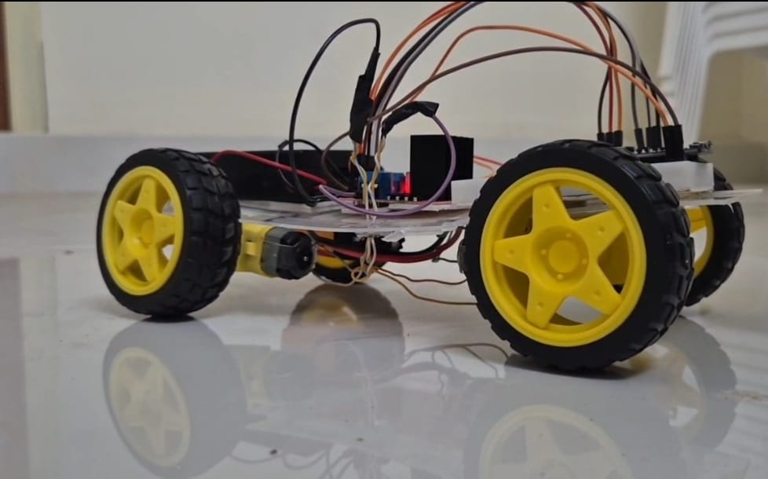
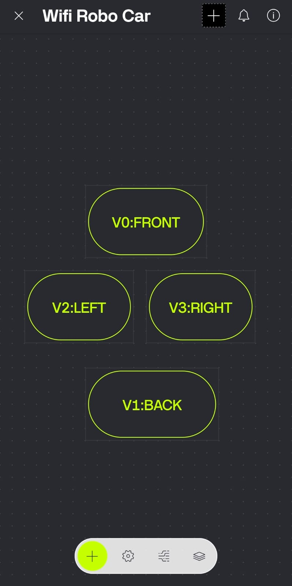

# 🚗 WiFi Robo Car using ESP8266 and Blynk

A WiFi-controlled robotic car built using the ESP8266 NodeMCU, L298N motor driver, and the Blynk IoT platform. The robot can be controlled wirelessly through a smartphone connected to the same WiFi network.

---

## 📌 Features

- 📶 WiFi-based Robot Control
- 📱 Blynk Mobile Application
- ⬆️ Forward Movement
- ⬇️ Backward Movement
- ⬅️ Left Turn
- ➡️ Right Turn
- 🛑 Stop Function
- ⚡ Easy to Build

---

## 🛠 Hardware Components

- ESP8266 NodeMCU
- L298N Motor Driver
- DC Geared Motors
- Robot Chassis
- Wheels
- Battery Pack
- Jumper Wires

---

## 💻 Software Requirements

- Arduino IDE
- ESP8266 Board Package
- Blynk IoT Library

---

## 🔌 Pin Connections

| ESP8266 | L298N |
|----------|--------|
| D1 | IN1 |
| D2 | IN2 |
| D3 | IN3 |
| D4 | IN4 |

---

## 📱 Blynk Controls

| Virtual Pin | Function |
|-------------|----------|
| V0 | Forward |
| V1 | Backward |
| V2 | Left |
| V3 | Right |

---

## 🚀 Installation

1. Install Arduino IDE.
2. Install the ESP8266 Board Package.
3. Install the Blynk Library.
4. Update:
   - WiFi SSID
   - WiFi Password
   - Blynk Template ID
   - Auth Token
5. Upload the code to ESP8266.
6. Open the Blynk app and control the robot.

---

## 📷 Project Images

### Robot



### Circuit Diagram


### Blynk App



---

## 📂 Project Structure

```
WiFi-Robo-Car-ESP8266
│
├── WiFi_Robo_Car.ino
├── README.md
├── LICENSE
├── images
└── docs
```

---

## 🚀 Future Improvements

- PWM Speed Control
- Obstacle Avoidance
- Camera Streaming
- Voice Control
- Line Following Mode

---

## 👨‍💻 Author

**Kadimi Srikanth**

---

## ⭐ Support

If you found this project useful, please give it a ⭐ on GitHub.
